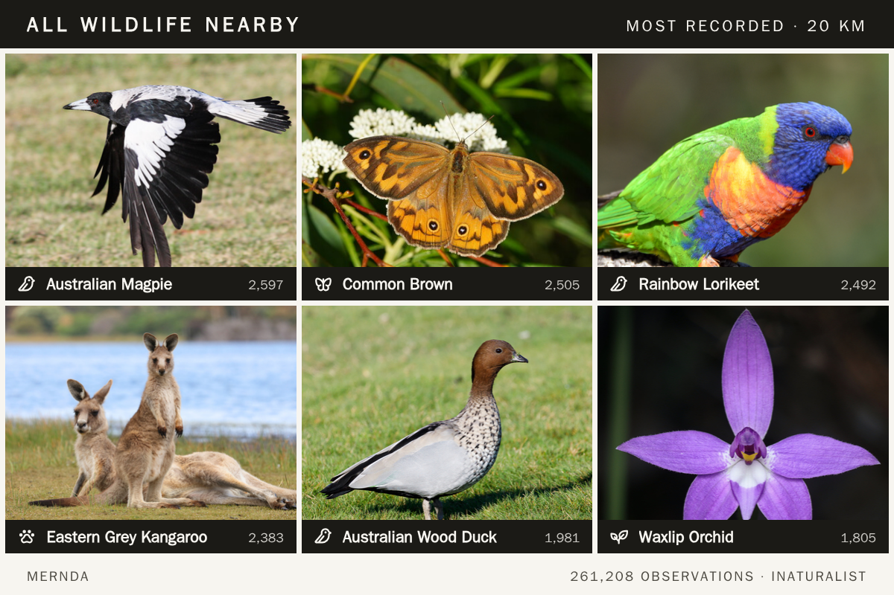
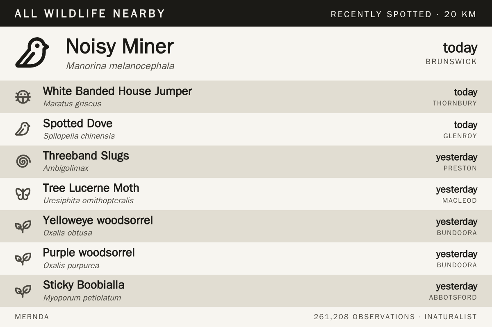
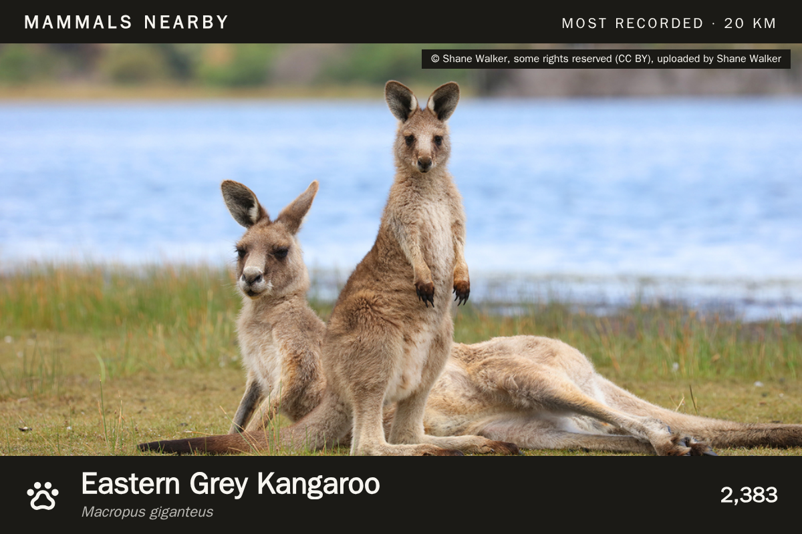
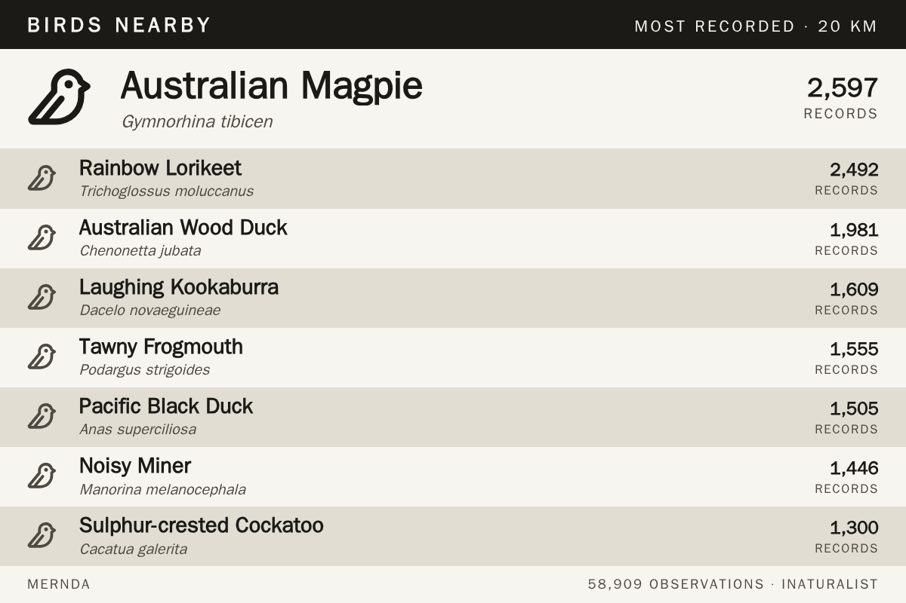

# wildlife_nearby

What has actually been seen around your panel — the species most often recorded
nearby, or the ones spotted in the last day or two.

## Two modes

**Recently spotted** is the newest observations, one row per species, with how
long ago and which suburb. It changes almost daily.

**Most recorded** is the steady picture of what lives here, by observation
count. It barely moves from week to week, which makes it the better choice for
a panel you glance at.

## Where the data comes from

[iNaturalist](https://www.inaturalist.org)'s public API. No key, no account.

GBIF was the obvious alternative and holds far more records — 1.5 million inside
a box over the test location, against iNaturalist's 260,000. It was still the
wrong choice: GBIF's freshest record there was **five weeks old**, because
observations reach it through periodic dataset publication. iNaturalist had
sightings from that morning. For "recently spotted" the lag is the whole
question, so the smaller, fresher archive wins.

Set **Verified identifications only** to restrict to iNaturalist's research
grade, where the identification has been confirmed by other people.

## Three layouts

`list` is icon, common name, scientific name and the metric — the one for
greyscale e-ink. `photo` is a single species with the observer's own
photograph. `gallery` is a photo grid.

The photographs are contributed by iNaturalist's observers under Creative
Commons licences, so the widget displays the attribution with them. The photo
layouts fetch images at render time; the list layout does not.

## Groups

Filter to birds, mammals, insects, spiders, plants, fungi, reptiles,
amphibians or fish — or take everything.

Each row carries an icon for its group, but only where an icon genuinely
depicts it: birds, mammals, insects, spiders, plants, molluscs and fish.
Everything else — fungi, reptiles, amphibians, and the Animalia, Protozoa,
Chromista and unknown that iNaturalist also returns — gets a pair of
binoculars, meaning *a sighting, unspecified*. An approximate icon is worse
than an honest generic one.

## Options

| Option | Notes |
| --- | --- |
| Location | Falls back to the app-level location in Settings. |
| Show | Recently spotted, or most recorded. |
| Layout | List, photo, or gallery. |
| Group | All wildlife, or one of nine groups. |
| Radius | 5 to 50 km. |
| How many species | 5 to 14. |
| Show scientific names | |
| Verified identifications only | iNaturalist research grade. |
| Refresh | 30 minutes to twice a day. |

## Rate limits

iNaturalist allows 60 requests a minute and asks callers to identify
themselves; this widget sends a User-Agent and makes one call per refresh, with
the result cached for the refresh interval. Hourly is plenty — new observations
do not arrive faster than that in most places.

## Licence

AGPL-3.0. See [LICENSE](LICENSE). Observation data and photographs from
[iNaturalist](https://www.inaturalist.org), contributed by its observers under
their own licences. Not affiliated with iNaturalist.
